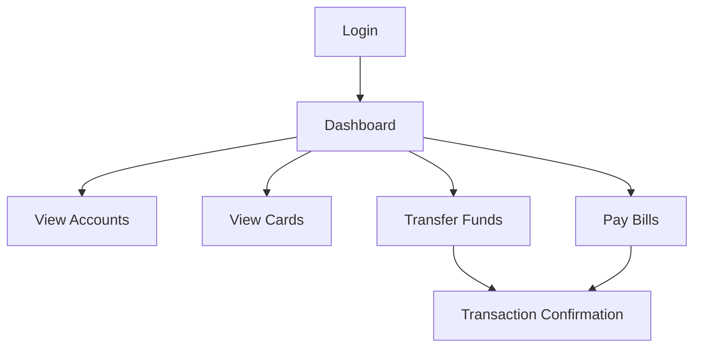
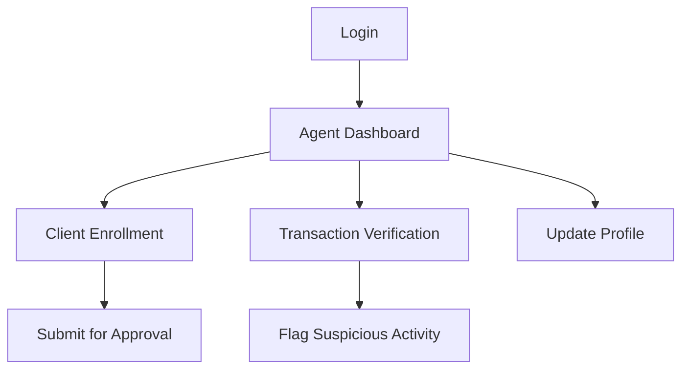

# e-banking-app (Demo)

This repository contains an Angular-based e-banking frontend scaffold with Firebase (Auth + Firestore) integration.

Included:
- Firebase environment placeholders (`src/environments/environment.ts`, `environment.prod.ts`)
- AngularFire initialization in `src/app/app.config.ts`
- `AuthService` using `@angular/fire/auth` for sign in / sign up / sign out (or mock fallback)
- `AccountsService` and `TransactionsService` using Firestore (or mock fallback)
- `LoginComponent` and a demo `DashboardComponent` to showcase the services
- `auth` interceptor updated to attach Firebase ID tokens

Quick start

1. Install dependencies:
```bash
npm install
```

2. Configure Firebase (optional)
- By default the repository ships with `src/environments/environment.ts` set to use mock data so there are no secrets in the repo.
- To use a real Firebase project, copy `src/environments/environment.example.ts` to `src/environments/environment.ts`, fill the values and set `useMock: false`.

Seeding / Mock data
- The app includes an in-memory seeded dataset (users, accounts, transactions) used when `useMock: true`.
- No external seeding step is required; the demo dashboard reads that mock data automatically.

3. Run the dev server:
```bash
npm start
```

4. Open the demo pages:
- Login: `http://localhost:4200/auth/login`
- Demo dashboard (lists accounts/transactions): `http://localhost:4200/demo`


Notes
- The demo dashboard uses mock data shipped in `MockDataService` by default. You can modify the seeded arrays in `src/app/services/mock/mock-data.service.ts`.
- If you switch to Firebase (set `useMock: false`), create documents in Firestore collections `accounts` and `transactions` or use the provided services to add data.
To use server-side REST endpoints instead of Firebase, scaffold an Express API inside `src/server.ts`.

Next recommended steps
- Add environment-specific Firebase configuration via CI or environment variables.
- Add proper role-based access control in `AuthGuard`.
- Add unit tests for services and components.
# 🏦 E-Banking Application

<p align="center">
  
  
  
  
</p>

A modern, secure, and user-friendly e-banking application with role-based access control for clients, bank agents, and administrators. Built with Angular and TailwindCSS.

## ✨ Features

### 👤 Client Portal

- Dashboard with financial overview
- Bank card management
- Transaction history and analytics
- Account management
- Funds transfer capabilities
- Customizable user interface

### 👨‍💼 Bank Agent Capabilities

- Client enrollment and verification
- Transaction monitoring and verification
- Profile and branch management
- Customer support tools

### 👑 Admin Features

- System-wide monitoring dashboard
- User management
- Currency management
- Security settings and controls
- Activity and audit logs

## 🏗️ Architecture

The application follows a modular architecture with feature-based organization:

```
e-banking-app/
├── src/
│   ├── app/
│   │   ├── features/             # Feature modules
│   │   │   ├── client/           # Client-specific features
│   │   │   ├── admin/            # Admin-specific features
│   │   │   └── bank-agent/       # Bank agent features
│   │   │
│   │   ├── layouts/              # Layout components
│   │   │   ├── client-layout/
│   │   │   ├── admin-layout/
│   │   │   └── agent-layout/
│   │   │
│   │   ├── shared/               # Shared modules and components
│   │   │   ├── ui/               # Reusable UI components
│   │   │   ├── navigation/       # Navigation components
│   │   │   └── services/         # Shared services
│   │   │
│   │   ├── app.routes.ts         # Application routes
│   │   └── app.config.ts         # App configuration
│   │
│   ├── assets/                   # Static assets
│   └── styles.css                # Global styles
```

## 🚀 Getting Started

### Prerequisites

- Node.js (v18 or higher)
- npm (v9 or higher)

### Installation

1. Clone the repository

```bash
git clone https://github.com/yourusername/e-banking-app.git
cd e-banking-app
```

2. Install dependencies

```bash
npm install
```

3. Start the development server

```bash
ng serve
```

4. Open your browser and navigate to `http://localhost:4200`

## 🖥️ User Interfaces

### Role-Based Layouts

The application provides three distinct layouts based on user roles:

- **Client Layout** (`/dashboard`) - Personal banking interface
- **Bank Agent Layout** (`/bank-agent/dashboard`) - Agent operations interface
- **Admin Layout** (`/admin/dashboard`) - Administrative control panel

## 🔄 Workflow

### Client Journey



### Bank Agent Journey



## 📱 Responsive Design

The application is fully responsive and works seamlessly across desktop, tablet, and mobile devices thanks to TailwindCSS utility classes.

## 🔒 Security Features

- Role-based access control
- Session management
- Input validation and sanitization
- Secure API communication
- Suspicious activity monitoring

## 🛠️ Development

### Adding New Components

```bash
ng generate component features/my-feature/my-component --standalone
```

### Running Tests

```bash
# Unit tests
ng test

# End-to-end tests
ng e2e
```

### Building for Production

```bash
ng build --configuration production
```

## 🔌 Backend Integration

The frontend is designed to integrate with any modern REST API. Configure the API endpoints in the environment files.

## 📜 License

This project is licensed under the MIT License - see the LICENSE file for details.

## 🤝 Contributing

Contributions are welcome! Please feel free to submit a Pull Request.

1. Fork the repository
2. Create your feature branch (`git checkout -b feature/amazing-feature`)
3. Commit your changes (`git commit -m 'Add some amazing feature'`)
4. Push to the branch (`git push origin feature/amazing-feature`)
5. Open a Pull Request
